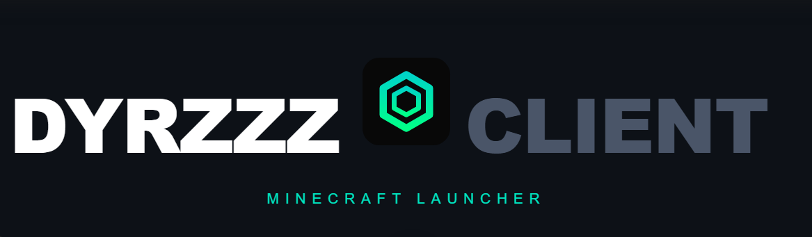

<div align="center">


A fast, modern Minecraft launcher built for players who want full control over their profiles, mods, and game versions.

[Download](#download) • [Features](#features) • [Installation](#installation) • [Building](#building-from-source)

</div>

---

## Features

- **Profile management** — create multiple profiles each with their own mods, worlds and settings
- **Mod loader support** — install Fabric and NeoForge with one click
- **Version browser** — browse and search all Minecraft releases and snapshots
- **Discord integration** — rich presence shows what you're playing
- **System tray** — runs quietly in the background, launch anytime
- **Launch at startup** — optionally start DyrzzzClient when Windows boots
- **Microsoft account** — full Microsoft/Xbox authentication support

---

## Download

Head to the [Releases](../../releases) page and download the latest `DyrzzzClient-Setup.exe`.

---

## Installation

1. Download `DyrzzzClient-Setup.exe` from [Releases](../../releases)
2. Run the installer and choose your install location
3. Launch DyrzzzClient from your desktop or start menu
4. Sign in with your Microsoft account
5. Create a profile and start playing

---

## Building from source

**Requirements:** Node.js 18+, Git

```bash
git clone https://github.com/Dierfn/dyrzzz-client-new.git
cd dyrzzz-client-new
npm install
npm start
```

To build the installer:

```bash
npm run dist
```

---

## Tech stack

- [Electron](https://electronjs.org) — desktop app framework
- [electron-builder](https://www.electron.build) — packaging and installer
- [discord-rpc](https://github.com/discordjs/RPC) — Discord rich presence

---

<div align="center">
  <sub>Made by <a href="https://github.com/Dierfn">Dierfn</a></sub>
</div>
